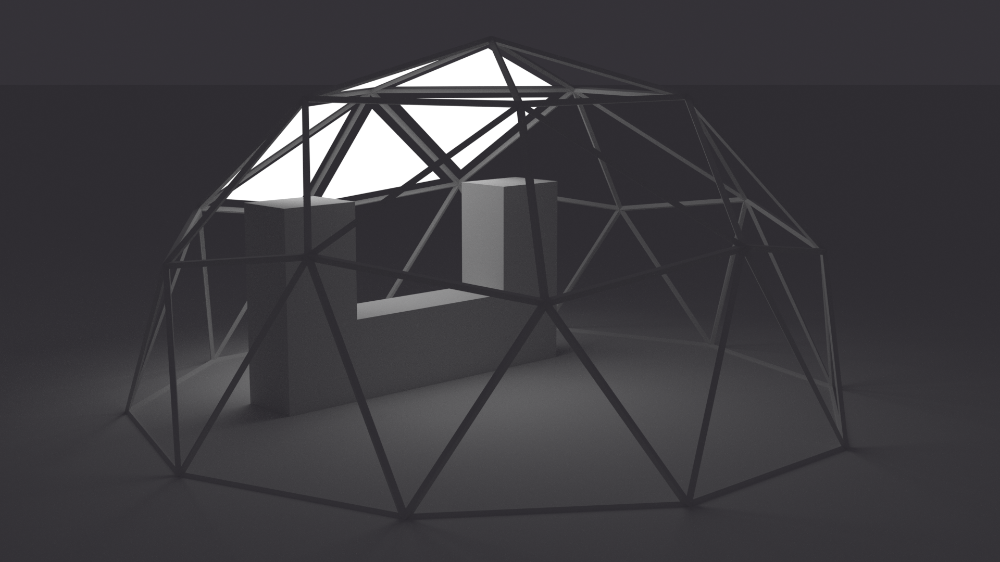
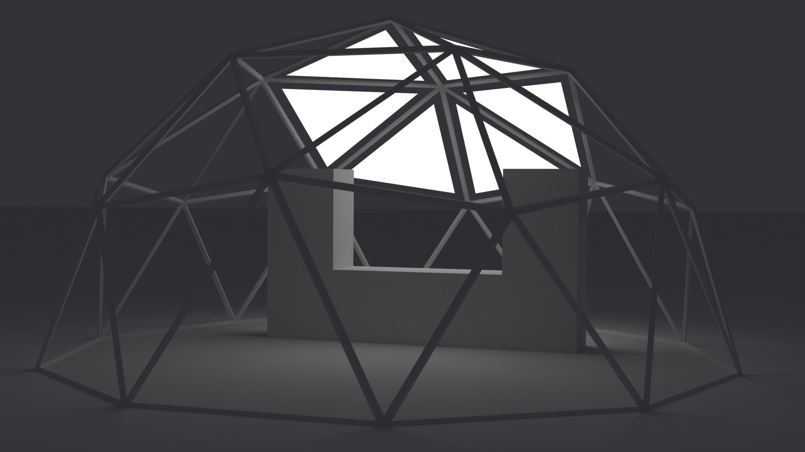

# Flavius LEDPortal

This is a fork of the excellent [LX Studio](http://lx.studio/) by Heronarts, Please read the [copyright and licensing notices](#lx-studio-notices) at the bottom of this readme.

[](https://www.instagram.com/p/CbS3AbflKWw)

[](https://www.instagram.com/p/CJTP5TdHwyo)

[](https://www.youtube.com/watch?v=Ui-maztzuMk)



LEDPortal is an interactive LED art project started by the Flavius theme camp for Burning Seed in 2020.

Some videos of development progress:

- <https://www.instagram.com/p/CI5hzQbnzGE>
- <https://www.instagram.com/p/CC-x_NOnNkP>
- <https://www.instagram.com/p/CBuyp0GHbRQ>

## Running LedPortal

There are two ways to do this, you can bring your own Java JDK or use the JDK bundled with Processing. You should try with Processing Java first. You will also need to ensure you are using the correct Java JDK by setting the `JAVA_HOME` environment variable.

### Prerequisites

- Maven (if not using IntelliJ / Eclipse)
- Java JDK 17 preferably from [Adoptium](https://adoptium.net/)

#### Adoptium Ubuntu Install

```bash
wget "https://github.com/adoptium/temurin11-binaries/releases/download/jdk-11.0.14.1%2B1/OpenJDK11U-jdk_x64_linux_hotspot_11.0.14.1_1.tar.gz"
sudo tar zxvf OpenJDK11U-jdk_x64_linux_hotspot_11.0.14.1_1.tar.gz -C /usr/lib/jvm
```

#### Set Java Home

If you have multiple versions of Java installed, you will need to explicitly set the `JAVA_HOME` environment variable for any shell you use to build / run this project.

#### on MacOS

You can list possible Java homes with

```bash
/usr/libexec/java_home -V
```

```txt
...
11.0.14.1, x86_64:  "Eclipse Temurin 11"    /Library/Java/JavaVirtualMachines/temurin-11.jdk/Contents/Home
...
```

and set your JAVA_HOME to use JDK 11 with

```bash
export JAVA_HOME="`/usr/libexec/java_home -v 11`"
```

#### Setting Java Home on Ubuntu

```bash
sudo update-alternatives --install "/usr/bin/java" "java" "/usr/lib/jvm/jdk-11.0.14.1+1/bin/java" 1
sudo update-alternatives --set "java" "/usr/lib/jvm/jdk-11.0.14.1+1/bin/java"
```

#### Validating

You can ensure your shell has the correct version set by running

```bash
java -version
```

you should see

```txt
openjdk 11.0.14.1 2022-02-08
OpenJDK Runtime Environment Temurin-11.0.14.1+1 (build 11.0.14.1+1)
OpenJDK 64-Bit Server VM Temurin-11.0.14.1+1 (build 11.0.14.1+1, mixed mode)
```

## Using IntelliJ / Eclipse

The build config files have been provided for IntelliJ and Eclipse, so your IDE should will handle dependency resolution and building for you, however if you want to have the versatility of VSCode with maven, then you will need to see the next sections for how to install those dependencies

## Using VSCode and Maven

Several jars need to be installed into your local maven repository (e.g. `~/.m2/repository`) manually.

LEDPortal is based on LXStudio, which in turn is based on Processing. Additionally, some animations require external dependencies like video or gif libraries. There are several options for installing these. We recommend using those provided in this repository, however if the a library doesn't work or goes out of date, you can also try installing the library through the Processing library interface (**Sketch** → **Import Library** → **Add Library**), or downloading it manually, then test that it works by running one of the examples that the library provides.

The `groupId`, `artifactId` and `version` fields are important. You will need to update `.classpath`, `pom.xml` or your IDE configuration if the version installed by processing does not match. If it's not clear what version a library is, one way to determine this is with `unzip -q -c <jar path> META-INF/MANIFEST.MF`.

Use the libraries provided in `lib` before trying the libraries installed by processing.

### Maven Setup - MacOS

```bash
brew install maven
```

### Maven Setup - Ubuntu

```bash
sudo apt install maven
```

### Maven Setup - Windows with Choco

```powershell
# TODO: test the choco package for jdk 11
choco install openjdk11 -y
choco install maven Processing -y
```

- Install `vscjava.vscode-java-pack` VSCode extension
- Configure Java Runtime

### Heronarts libraries

These libraries have been provided in the `lib` folder

- [heronarts.lx](https://github.com/heronarts/lx)
- [heronarts.p4lx](https://github.com/heronarts/p4lx)
- heronarts.lxstudio (private)

```bash
export PROJ_VERSION="0.4.0"
mvn install:install-file "-Dfile=lib/lxstudio-${PROJ_VERSION}.jar" -DgroupId=heronarts -DartifactId=lxstudio "-Dversion=${PROJ_VERSION}" -Dpackaging=jar
mvn install:install-file "-Dfile=lib/lx-${PROJ_VERSION}-jar-with-dependencies.jar" -DgroupId=heronarts -DartifactId=lx "-Dversion=${PROJ_VERSION}" -Dpackaging=jar
mvn install:install-file "-Dfile=lib/p4lx-${PROJ_VERSION}.jar" -DgroupId=heronarts -DartifactId=p4lx "-Dversion=${PROJ_VERSION}" -Dpackaging=jar
```

You can also clone into the source code repositories (where available) and `mvn install` if you want to modify them.

### Processing libraries

lxstudio is based on [Processing 4.0b8](https://processing.org/download/). The necessary processing libraries are provided in `lib`

```bash
mvn install:install-file "-Dfile=lib/processing-4.0b8/core-4.0b8.jar" -DgroupId=org.processing -DartifactId=core "-Dversion=4.0b8" -Dpackaging=jar
mvn install:install-file "-Dfile=lib/processing-4.0b8/jogl-all-4.0b8.jar" -DgroupId=org.jogamp.jogl -DartifactId=jogl-all "-Dversion=2.4.0-rc-20210111" -Dpackaging=jar
mvn install:install-file "-Dfile=lib/processing-4.0b8/gluegen-rt-4.0b8.jar" -DgroupId=org.jogamp.gluegen -DartifactId=gluegen-rt-main "-Dversion=2.4.0-rc-20210111" -Dpackaging=jar
```

Alternatively, you can install the libraries provided by processing. If you are not on macOS and Processing 4.0b8, you may need to adjust the locations of the following library paths

```bash
# one of the following
export PROCESSING_CORE="/Applications/Processing.app/Contents/Java"
export PROCESSING_CORE="$HOME/Downloads/Processing-4.0b8.app/core/library"
export PROCESSING_CORE="$HOME/code/processing/core/library"
```

```bash
# one of the following
export PROCESSING_LIB="$HOME/Documents/Processing/libraries"
export PROCESSING_LIB="$HOME/sketchbook/libraries",
export PROCESSING_LIB="$HOME/sketchbook/libraries",
```

```bash
mvn install:install-file -Dfile=${PROCESSING_CORE}/core.jar -DgroupId=org.processing -DartifactId=core "-Dversion=4.0b8" -Dpackaging=jar
mvn install:install-file -Dfile=${PROCESSING_CORE}/gluegen-rt-natives-linux-amd64.jar -DgroupId=com.jogamp -DartifactId=gluegen-rt-main "-Dversion=2.4.0-rc-20210111" -Dpackaging=jar
mvn install:install-file -Dfile=${PROCESSING_CORE}/jogl-all-natives-linux-amd64.jar -DgroupId=com.jogamp -DartifactId=jogl-all "-Dversion=2.4.0-rc-20210111" -Dpackaging=jar
```

**On Windows:**

```powershell
# TODO: update to 4.0b8
mvn install:install-file "-Dfile=C:\ProgramData\chocolatey\lib\Processing\tools\processing-3.5.4\core\library\core.jar" "-DgroupId=org.processing" "-DartifactId=core" "-Dversion=3.5.4" "-Dpackaging=jar"
```

### Video libraries

Some animations require the [Processing Video library](https://github.com/processing/processing-video). This is provided in `lib`:

<!-- TODO: install instructions for video-2.0 -->

```bash
mvn install:install-file "-Dfile=lib/video-1.0.1/video.jar" -DgroupId=org.processing -DartifactId=video -Dversion=1.0.1 -Dpackaging=jar
mvn install:install-file "-Dfile=lib/video-1.0.1/gstreamer-java.jar" -DgroupId=org.gstreamer -DartifactId=gstreamer-java -Dversion=1.6.2 -Dpackaging=jar
mvn install:install-file "-Dfile=lib/video-1.0.1/jna.jar" -DgroupId=com.sun -DartifactId=jna -Dversion=4.2.0 -Dpackaging=jar
```

```bash
# export VIDEO_LIB="$HOME/code/processing-video/"
export VIDEO_LIB="$PROCESSING_LIB/video"
```

video.jar:

```bash
mvn install:install-file -Dfile=${VIDEO_LIB}/library/video.jar -DgroupId=org.processing -DartifactId=video -Dversion=2.0 -Dpackaging=jar
```

gstreamer: may require system install of gstreamer library

```bash
# one of the following
mvn install:install-file -Dfile=${VIDEO_LIB}/library/gst1-java-core-1.2.0.jar -DgroupId=org.gstreamer -DartifactId=gst1-java-core -Dversion=1.2.0 -Dpackaging=jar
mvn install:install-file -Dfile=${VIDEO_LIB}/library/gst1-java-core-1.4.0.jar -DgroupId=org.gstreamer -DartifactId=gst1-java-core -Dversion=1.4.0 -Dpackaging=jar
```

jna

```bash
mvn install:install-file -Dfile=${VIDEO_LIB}/library/jna.jar -DgroupId=com.sun -DartifactId=jna -Dversion=5.4.0 -Dpackaging=jar
```

### gif library

[Processing Gif-Animation Library](https://github.com/extrapixel/gif-animation/tree/3.0) is in `lib`

```bash
mvn install:install-file "-Dfile=lib/gifAnimation-3.0.0/gifAnimation.jar" -DgroupId=extrapixel -DartifactId=gifAnimation -Dversion=3.0.0 -Dpackaging=jar
```

or install externally with

```bash
export GIF_LIB="$PROCESSING_LIB/gifAnimation"
```

```bash
mvn install:install-file "-Dfile=${GIF_LIB}/library/gifAnimation.jar" "-DgroupId=extrapixel" "-DartifactId=gifAnimation" "-Dversion=3.0.0" "-Dpackaging=jar"
```

## Maven Compile

You can compile this repository with the following commands, you may need to adjust your java home

```bash
# set JAVA_HOME first!
mvn compiler:compile assembly:single
```

This is provided as a VSCode build task in `.vscode/tasks.json`

## Run with BYO Java

```bash
# set JAVA_HOME first!
# you will need to update this if your libraries were sourced from somewhere else.
# TODO: update to 4.0b8
export CLASSPATH="$(echo \
  lib/processing-4.0b8/core-4.0b8.jar \
  lib/processing-4.0b8/gluegen-rt-4.0b8.jar \
  lib/processing-4.0b8/jogl-all-4.0b8.jar \
  lib/video-1.0.1/video.jar \
  lib/video-1.0.1/gstreamer-java.jar \
  lib/video-1.0.1/jna.jar \
  lib/gifAnimation-3.0.0/gifAnimation.jar \
  target/lxstudio-ide-0.4.0-jar-with-dependencies.jar \
  | sed 's/ /:/g'
)"
java heronarts.lx.app.LXStudioApp
```

```
lib/processing-4.0b8/core-4.0b8.jar:lib/processing-4.0b8/gluegen-rt-4.0b8.jar:lib/processing-4.0b8/jogl-all-4.0b8.jar:lib/video-1.0.1/video.jar:lib/video-1.0.1/gstreamer-java.jar:lib/video-1.0.1/jna.jar:lib/gifAnimation-3.0.0/gifAnimation.jar:target/lxstudio-ide-0.4.0-jar-with-dependencies.jar
```

This is provided as a VSCode build task in `.vscode/tasks.json`

### Debugging

#### Serial ports not working on Ubuntu

Try adding the user to the `tty` and `dialout` groups

```bash
sudo usermod -a -G tty $USER
sudo usermod -a -G dialout $USER
sudo reboot now
```

Create a new Processing 3 sketch and test your serial port is detected

```java
import processing.serial.*;

void setup()  {
  // print a list of the serial ports:
  printArray(Serial.list());
}
```

#### Video not working on Ubuntu

Open the Processing IDE, and go **file -> examples -> video -> movile -> loop**. Run the sketch to test your gstreamer install

If that doesn't work, ensure you have gstreamer libaries installed

```bash
sudo apt install gstreamer1.0-x libgstreamer-plugins-base1.0-dev libgstreamer-plugins-good1.0-dev
```

do not install plugins-bad!!

you may also need some codecs to play certain videos

```bash
sudo apt-get install ubuntu-restricted-extras ffmpeg vlc
```

install processing from source

```bash
git clone
cd processing
```

## LX Studio Notices

**BY DOWNLOADING OR USING THE LX STUDIO SOFTWARE OR ANY PART THEREOF, YOU AGREE TO THE TERMS AND CONDITIONS OF THE [LX STUDIO SOFTWARE LICENSE AND DISTRIBUTION AGREEMENT](http://lx.studio/license).**

Please note that LX Studio is not open-source software. The license grants permission to use this software freely in non-commercial applications. Commercial use is subject to a total annual revenue limit of $25K on any and all projects associated with the software. If this licensing is obstructive to your needs or you are unclear as to whether your desired use case is compliant, contact me to discuss proprietary licensing: mark@heronarts.com

---


[LX Studio](http://lx.studio/) is a digital lighting workstation, bringing concepts from digital audio workstations and modular synthesis into the realm of LED lighting control. Generative patterns, interactive inputs, and flexible parameter-driven modulation — a rich environment for lighting composition and performance.

### Getting Started

LX Studio runs using the Processing 4 framework. This version of the project directly embeds those dependencies and may be run from within a Java IDE,
for larger projects in which the Processing IDE is insufficient. The example project here can be run either using the full Processing-based UI,
or alternatively in a headless CLI-only mode.

To get started, clone this repository and import the project into an IDE like Eclipse or IntelliJ. Configuration files for both are readily
available in the repository.

Documentation is available on the [LX Studio Wiki &rarr;](https://github.com/heronarts/LXStudio/wiki)

Consult the [LX Studio API reference &rarr;](http://lx.studio/api/)

### Configure Your Runtime

Processing 4.0 beta 8 runs on [Eclipse Temurin 17 (17.0.2+8)](https://adoptium.net/). It is highly recommend to use this JDK for consistency.

Running the project requires passing `-Djava.library.path=lib/processing-4.0b8/native` explicitly to the `java` command. Note that `native` is a symlink within the `processing-4.0b8` folder which should be pointed at the appropriate target platform folder.

This is pre-configured in the Eclipse launch configuration `LXStudioApp.launch`

If you change platforms, update the symlink using one of the following:

```bash
ln -hsf lib/processing-4.0b8/linux-aarch64 lib/processing-4.0b8/native
ln -hsf lib/processing-4.0b8/linux-amd64 lib/processing-4.0b8/native
ln -hsf lib/processing-4.0b8/linux-arm lib/processing-4.0b8/native
ln -hsf lib/processing-4.0b8/macos-aarch64 lib/processing-4.0b8/native
ln -hsf lib/processing-4.0b8/macos-x86_64 lib/processing-4.0b8/native
ln -hsf lib/processing-4.0b8/windows-amd64 lib/processing-4.0b8/native
```

### Contact and Collaboration

Building a big cool project? I'm probably interested in hearing about it! Want to solicit some help, request new framework features, or just ask a random question? Open an issue on the project or drop me a line: mark@heronarts.com

---

HERON ARTS MAKES NO WARRANTY, EXPRESS, IMPLIED, STATUTORY, OR OTHERWISE, AND SPECIFICALLY DISCLAIMS ANY WARRANTY OF MERCHANTABILITY, NON-INFRINGEMENT, OR FITNESS FOR A PARTICULAR PURPOSE, WITH RESPECT TO THE SOFTWARE.
